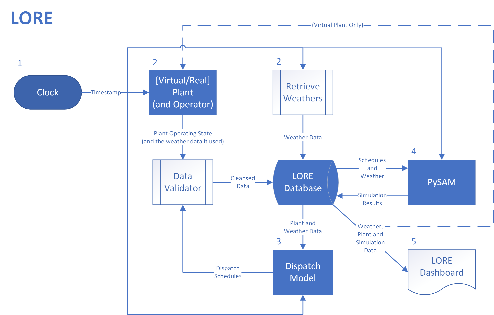

# Live Operations Recommendations Engine (LORE)



This project develops a user interface for the design, analysis, and optimization of concentrating solar power 
(CSP) systems, including optimization of both physical design variables and operations and maintenance 
(O&M) activity. The software is derived and actively developed under funding from the U.S. Department of 
Energy -- Energy Efficiency and Renewable Energy grant DE-EE00034245 ("Real-time operations optimization software") and was previously funded under grant DE-EE000030338 ("Concurrent optimization of capital 
cost and expected O&M").

This work is the result of a collaboration between researchers and industry, including: 
* National Renewable Energy Laboratory 
* Colorado School of Mines
* Northwestern University

* This repository, **LORE**, provides the user interface to assign values to inputs of the computational modules, run the modules in the correct order, and display calculation results. It also includes tools for editing LK scripts, viewing field layout and receiver flux map data, and performing multi-dimensional system optimization.


## Quick Steps for Building LORE

These are the general quick steps you need to follow to set up your computer for developing LORE:

1. Set up your development tools:

    * Windows: Visual Studio Code [here](https://www.visualstudio.com/).
    * Linux: g++ compiler available [here](http://www.cprogramming.com/g++.html) or as part of the Linux distribution.


Windows distributions require the following DLL's:
``` dbghelp, libcurl, libeay32, libssh2, msvcp120, msvcr120, ssleay32, vcruntime140 ```
These can be located from system path directories or downloaded from [NREL's FTP server](https://pfs.nrel.gov/main.html?download&weblink=2803bc659530b139621bbacc1b80910f&realfilename=nrelapp-win-dynlibs.zip).

## Repository Access

Access is currently limited only to project partners. To obtain access, please send a request to [Mike](mailto://mike.wagner@nrel.gov).

## Contributing

## License

LORE open source code is copyrighted by the U.S. Department of Energy -- Energy Efficiency and Renewable Energy under a [mixed MIT and GPLv3 license](https://github.com/NREL/lore/blob/develop/LICENSE.md). It allows for-profit and not-for-profit organizations to develop and redistribute software based on LORE under terms of an MIT license and requires that research entities including national laboratories, colleges and universities, and non-profit organizations make the source code of any redistribution publicly available under terms of a GPLv3 license.

## Project organization

The code in this project is organized as follows:

| Folder				| Description |
|-------------------|------------------------------------|
| ./libclearsky | Source code for clear sky irradiance model |
| ./libcluster | Source code for the data clustering model |
| ./libcycle | Source code for the cycle availability and failure model |
| ./liboptical | Source code for the optical degradation and soiling model |
| ./liboptimize | Source code and libraries for the nonlinear design optimization problem |
| ./librtdispatch | Source code for the real-time dispatch optimization model |
| ./libsolar | Source code for the solar field failure model |
| ./loredash | Source code for the LORE mediator |

Additional instructions on installing and running LORE, as well as viewing the dashboard, are available in the README within the ./loredash folder.


## External libraries

LORE utilizes the following open-source libraries:

| Project | Version | Usage |
|---------|---------|-------|
| [RapidJSON](https://github.com/Tencent/rapidjson)  	| v1.1.0 	| JSON read-write library for project files |

## SSL Requests

LORE utilizes SSL requests to obtain weather data that serve as inputs to the dispatch optimzation model.  These requests can cause an SSL error when LORE is run thorugh a virtual network connection, and firewall settings may need to be adjusted to allow requests to the [THREDDS server](https://ds.nccs.nasa.gov/).
