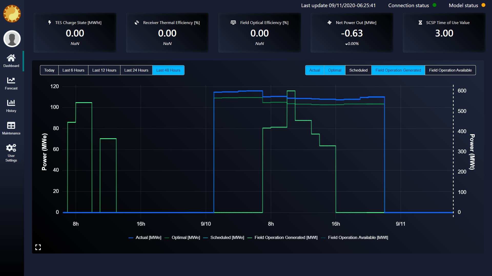
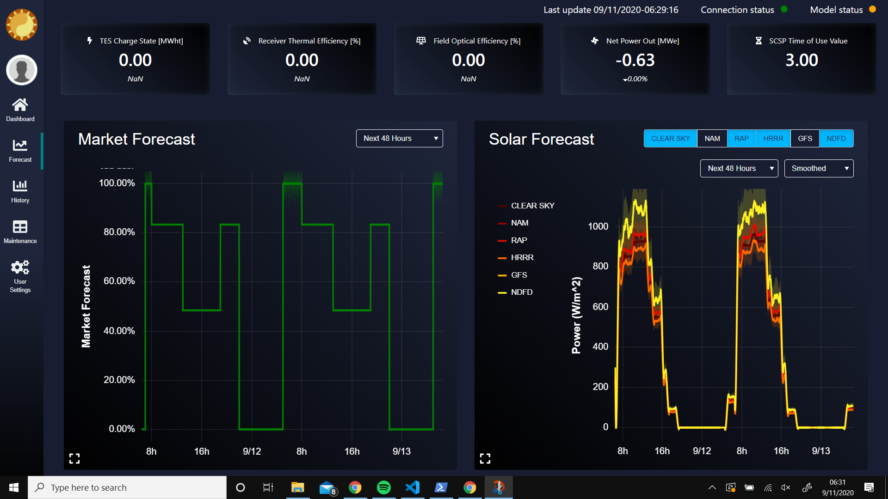
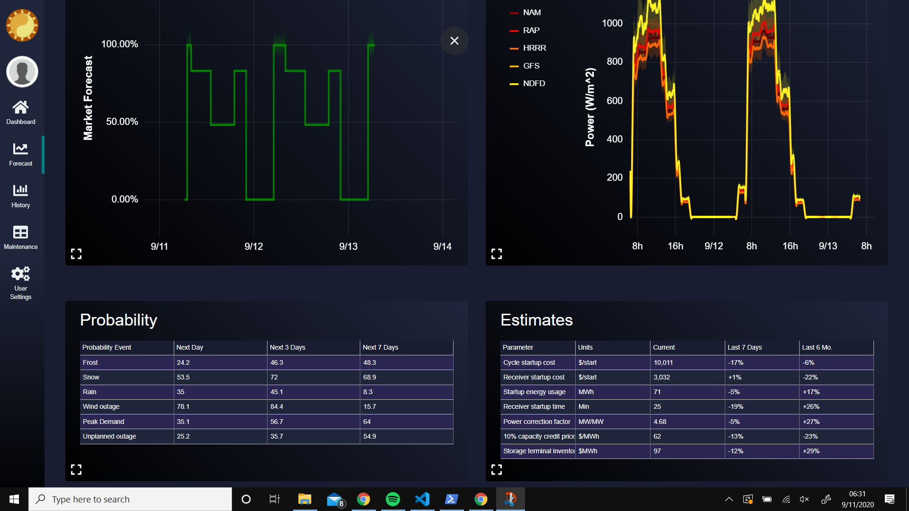
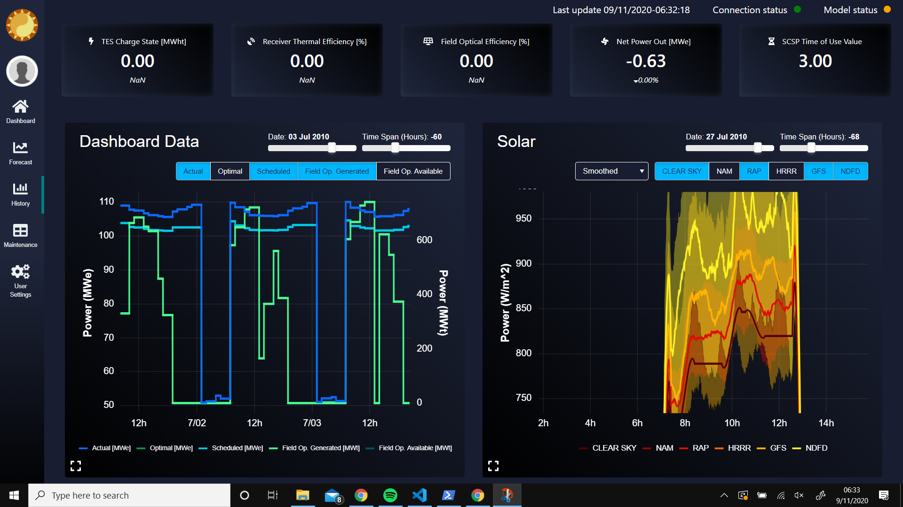
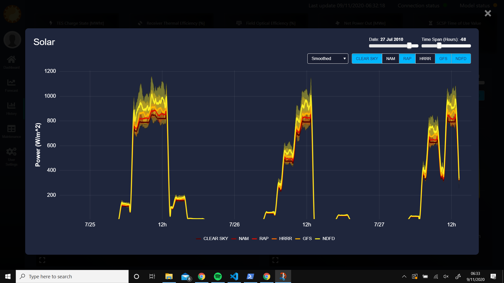
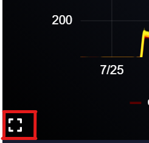

# UI Dashboard

The UI dashboard is based on [Django](https://www.djangoproject.com/), which is a high-level Python web framework. In order to have interactive plots that are driven by Python code executed real-time, a charting server is needed. The open-source visualization library [Bokeh](https://bokeh.org/) is used for this purpose. Bokeh can be run a number of different ways, but running as a charting server is necessary to have Python-driven interative plots.

For production testing, the web server [Waitress](https://docs.pylonsproject.org/projects/waitress/en/stable/) is used along with the [Nginx](https://www.nginx.com/) web server. The Nginx server is configured as a public-facing reverse proxy that passes the outside web requests to the Waitress server, but predominantly it is needed to serve the static files.


## Run via remotely hosted Docker image
1. Request Docker Hub repository access to @Matthew-Boyd
2. Start Docker Desktop
	1. Download and install from [docker.com](https://www.docker.com/products/docker-desktop)
	2. Start Docker Desktop. If you get a not-enough-memory error:
		1. Download and run [RAMMap](https://docs.microsoft.com/en-us/sysinternals/downloads/rammap)
		2. Empty -> Empty Working Sets
		3. File -> Refresh
		4. Close
		5. If this fails, restart your computer.
3. Open the Images section in Docker Desktop and delete any prior lore images (if not the first time testing)
4. Right-click the Docker tray icon and switch to Linux containers if needed (if there’s an option that says ‘Switch to Windows containers..’ then you’re already set)
5. Create a new folder outside of the lore repo and copy to it `docker-compose.yml`
6. Open a terminal (e.g., Anaconda Prompt) and change directory to this new folder
7. Create and activate a fresh python environment via:
	```
	conda create --name basic_3.8 python=3.8 -y
	conda activate basic_3.8
	```
8. Execute:
	```
	docker pull amd64/python:3.8-slim-buster
	docker pull matthewtboyd/lore:latest
	docker-compose up dash
	```
9. Open a browser to:
	```
	127.0.0.1:8000
	```


## Setup and run locally using Docker
1. Start Docker Desktop
	1. Download and install from [docker.com](https://www.docker.com/products/docker-desktop)
	2. Start Docker Desktop. If you get a not-enough-memory error:
		1. Download and run [RAMMap](https://docs.microsoft.com/en-us/sysinternals/downloads/rammap)
		2. Empty -> Empty Working Sets
		3. File -> Refresh
		4. Close
		5. If this fails, restart your computer.
2. Navigate in a terminal to `/lore/loredash`
3. Run:
	```
	docker-compose up dash
	```
4. Open a web browser to:
	```
	127.0.0.1:8000
	```

## Setup and run from Python
1. If first-time setup
	1. Create a new conda virtual environment and activate it. In a terminal (e.g., Anaconda Prompt):
		```
		conda create --name loredash python=3.8 -y
		conda activate loredash
		```
	2. Navigate to `/lore/loredash`
	3. Install requirements (must use pip instead of conda)
		```
		python -m pip install -r .\requirements.txt
		```
2. Navigate to `/lore/loredash` and activate the virtual environment
	```
	conda activate loredash
	```
3. If needed, migrate new/mock data to the database
	```
	python manage.py migrate
	python ./data/import_data.py ./data
	```
4. Start the plotting server
	```
	# On Windows:
	start powershell -noexit -file run_bokeh_server.ps1
	# On Linux:
	chmod +x run_bokeh_server.sh
	./run_bokeh_server.sh &
	```
5. Start the Django project
	```
	python manage.py runserver 127.0.0.1:8000
	```
6. Open the dashboard by going to the above address in a web browser

# Running Tests

To run the suite of tests during the development process, navigate to `/lore/loredash` and run
```
python -m pytest
```

# Dashboard Plots

The Dashboard stack currently uses Django and Bokeh both running on a server. These will both be run in production mode once on the local plant server.

The top of the Dashboard will be the same on the Dashboard, Forecast, and History Tabs. This header displays information that will update minutely. The five values indicate TES Charge State, Expected Solar Field Generation, Net Power Out, Annual Energy and Expected Revenue. The percentage values will represent the percent above or below their optimal amounts.

In the very top right of all pages there are indicators for the statuses of the Connection and the Model as well as the current time and date.

## Dashboard Home

_Dashboard Plot_

The Dashboad shows the current information for the plant. It will show the Actual, Optimal, Scheduled, Field Operation Generated and Available values for the current daily window as well as the last 6, 12, 24, and 48 hour windows. The radio buttons on the top left will allow for the selection of a window, and the select buttons on the top right allow for multiple plots to be shown at the same time with the two axes denoted on the left and right, with the legend below denoting which axes apply to which plots.

## Forecasts



_Forecasts Plots & Tables_

The Forecast tab will allow for the user to see the Market and Solar forecast data. Both plots have dropdowns for the window of time which will again come in 6, 12, 24, and 48 hour time blocks. The difference between these and the Dashboard plot time windows is that the windows are in the future from the current time.

The Probability and Estimates tables below provide information on weather predictions and startup and usage information for the current day, past week, and last 6 months.

## History

_History Plots_


_Zoomed In Feature_

The history plots show the same data from the dashboard and solar plots, except these plots have sliders. The two sliders on bot plots allow for the user to change the date and the time window. The time window goes from -120 to 120 hours (&#177; 10 days).

## Navigation
To Navigate to the plots, only the first three tabs on the right hand side are active. These will take you to a main dahsboard page, forecast page, and a history page as noted in the sections above.

To zoom in, one can either pinch using touch screens, or use the scroll wheel to zoom. To pan, simply click and drag. The plots will only update their plot renders on the minute, or as the user make different selections. To reset the plot, simply double click.

Each plot has a pop-up that can be used to look closer at a given chart. In the bottom left hand of each chart pane, there is an expand icon. Clicking on the expand icon will enlarge the selected plot. When that plot is openned you can resume all of the same functionality as in the regulary view. When you are done, simply click the 'x' in the top right corner, or press the ESC key.


