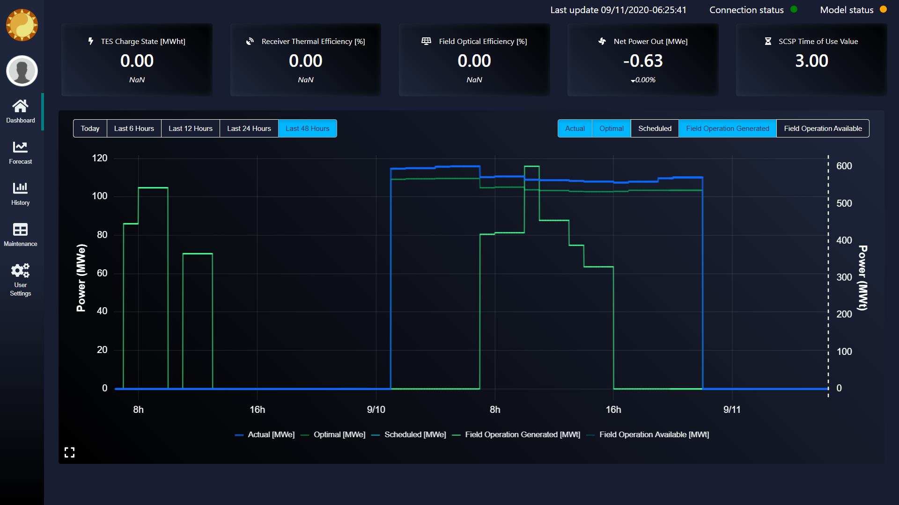
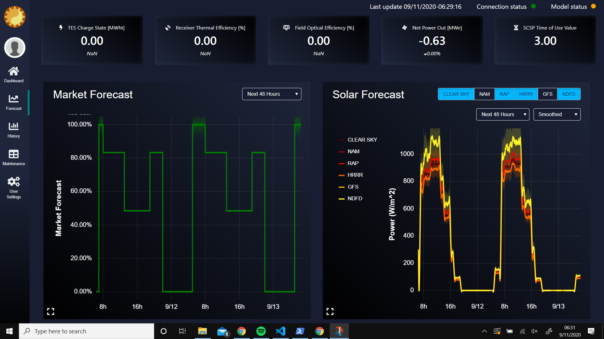
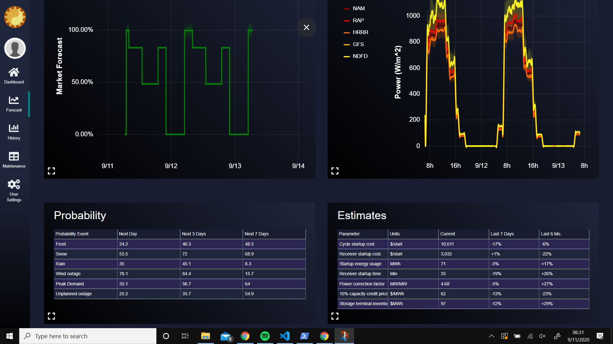
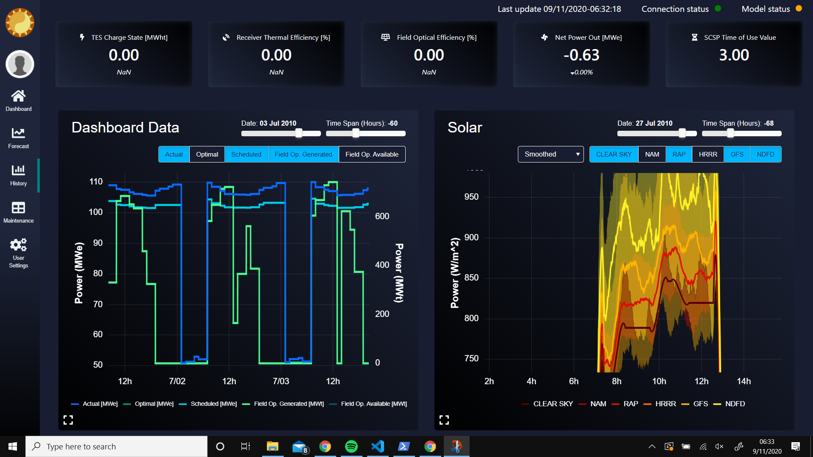
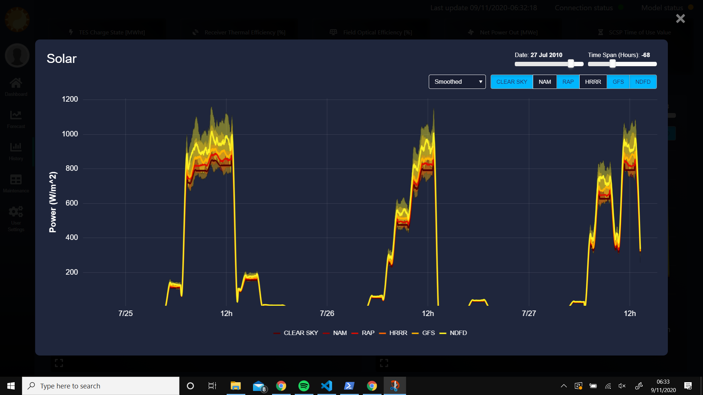

# UI Dashboard

The UI dashboard is based on [Django](https://www.djangoproject.com/), which is a high-level Python web framework. In order to have interactive plots that are driven by Python code executed real-time, a charting server is needed. The open-source visualization library [Bokeh](https://bokeh.org/) is used for this purpose. Bokeh can be run a number of different ways, but running as a charting server is necessary to have Python-driven interative plots.

The Bokeh server can be run alongside Django same as before, including while debugging in Visual Studio Code. However, in order to do so on a local machine, with or without an additional web server (e.g., Apache), you must add another loopback address. Normally, on the production server, the Bokeh charting server will utilize the default loopback address of 127.0.0.1 and the web server will utilize the public facing IP address. On a local machine, however, the IP address cannot be repurposed in this way so another loopback address must be added, for either the the web server or Django's manage.py module. In order to get another loopback address, a loopback adapter must be installed.

For production testing, the web server [Waitress](https://docs.pylonsproject.org/projects/waitress/en/stable/) is used along with the [Nginx](https://www.nginx.com/) web server. The Nginx server is configured as a public-facing reverse proxy that passes the outside web requests to the Waitress server, but predominantly it is needed to serve the static files.

**Steps to get the Bokeh server working alongside Django**
1. Obtain a second loopback address for Django or the web server. The original loopback address, 127.0.0.1, is now used by the Bokeh charting server.
  1. In a Command Prompt (cmd.exe) type: hdwwiz.exe
  2. Choose manual option, then Network adapters
  3. Choose Microsoft->Microsoft KM-TEST Loopback Adapter
  4. After it is installed, find the name of the adapter by typing "ipconfig /all" in a Command Prompt and looking for the Loopback Adapter entry. For example, the name is "Ethernet 5" if the block entry name is "Ethernet adapter Ethernet 5:"
  5. Configure the IP address, subnet mask and gateway. Choose a non-routable IP address like 10.10.10.10 (preferred). Configure this by entering this command at the command prompt:
    > netsh int ip set address "Ethernet 5" static 10.10.10.10 255.255.255.0 10.10.10.254 1
	
	  This is for the case of the name being 'Ethernet 5' and the chosen IP being 10.10.10.10
  6. Verify the change by running "ipconfig /all" again
  7. ***Very Important***: NREL computers will not allow a second network 'connection' at the same time as a WiFi connection (however, this may only be for NREL Wifi networks). The loopback adapter is seen as another network connection and thus WiFi will not work while this is present and enabled. To disable the loopback address and regain access to the NREL WiFi networks, start a command prompt with administrator privileges and run:
  
    > netsh interface set interface "Ethernet 5" disable
  
    This is for a loopback adapter named "Ethernet 5". To re-enable, just re-run the above command but change 'disable' to 'enable'
2. Add these system environment variables:
  1.  BOKEH_SECRET_KEY : 
  2.  BOKEH_SIGN_SESSIONS : False  (or True)   -> is this needed?
3. Start the Bokeh charting server in a dedicated prompt (I use an Anaconda Prompt as 'bokeh' is in the Path and thus recognized in any directory)
  1. Navigate to the directory with the Bokeh apps: "\dao-tk\web\site\ui\BokehApps\"
  2. Run:  bokeh serve sliders.py --allow-websocket-origin 10.10.10.10 --address 127.0.0.1
  3. You can add addition python files after sliders.py, separated by a space
  4. Note: this would eventually be done using a new, custom service
4. In a new prompt, start the Django server as usual but now use the new loopback address: 'python manage.py runserver 10.10.10.10:80' or debug in Visual Studio code using the 'Python: Django 10.10.10.10:80' configuration
5. Sometimes the Bokeh charting server websocket closes and won't reopen automatically when navigating away from a page with a Bokeh plot. Not sure why. When this happens, the Bokeh charting server needs to be restarted.

**Using a web server instead of manage.py**
1. 	Install a web server, in this case the Python "Waitress" package
2.  Add a reverse-proxy, in this case Nginx. This functions to forward requests from port 80 to port 8000 but more importantly serves the static files. For Windows:
  1.  Download the latest mainline version of Nginx: http://nginx.org/en/docs/windows.html
  2.  Extract and place files in C:\Program Files\nginx-X.X.X\
  3.  Configure nginx by replacing \conf\nginx.conf with the preconfigured file in this repo, but in the file replace any user-specific file paths with your own (e.g., "C:/Users/mboyd/...")
  4.  Anytime this config file is edited, restart Nginx, which can be done using the included restart_nginx.bat batch file.
3. Start the Nginx reverse proxy by running nginx.exe or the included batch file
4. Start the Waitress webserver using a dedicated  prompt (e.g., Anaconda Prompt for the same reason)
  1. Navigate to the main directory of the project: \dao-tk\web\site\
  2. Run:   waitress-serve --listen="10.10.10.10:8000" dtkweb.wsgi:application
  3. Note: this would eventually be done using a new, custom service
5. Open a web browser to:  http://10.10.10.10/ui    (which is port 80)
6. Navigate to the Outlook page to see an example Bokeh interactive chart.
  1. The chart is fully created in a python file
  2. Any changes to the input sliders call callback functions in this file
  3. Arbitrary Python code is executed and new plot data is created and the chart is automatically updated

**Explanation**
  * Navigating to http://10.10.10.10/ui   (implicit port 80) is intercepted by the Nginx reverse proxy and routed to http://10.10.10.10:8000/ui
  * http://10.10.10.10:8000 is the address of the Waitress web server . However, web servers shouldn't/can't be used to serve static content, like the images and CSS, and this is the purpose of the upstream Nginx reverse proxy.
  * You can navigate directly to http://10.10.10.10:8000 to see what the website looks like when bypassing the Nginx proxy, and thus without the static file content. Also, the Bokeh charts will not work as the source port of 8000 is not being allowed by the Bokeh server.

  **New Instructions using Powershell scripts (Windows) [9/10/2020]**
1. If the the latest versions of Python installed as well as PIP, go ahead and run <pre><code>python -m pip install -r requirements.txt</code></pre> from inside the ./lore/site/ directory. This will install all of the necessary packages to run python.
    >NOTE: It would be wise to setup a virtual environment before you run this command in case you have other projects which require different versions of other packages. A link explaining how to do so can be found here: https://packaging.python.org/guides/installing-using-pip-and-virtual-environments/)

2. Once the required pacakages are installed, the user can run the setup.ps1 script from the site folder either from the commandline using <pre><code>powershell .\setup.ps1</code></pre> or from a PowerShell terminal simply <pre><code>.\setup.ps1</code></pre> 
    >Make sure that you are still in the ./lore/site/ directory.

    > This step will walk you through the setup of the Loopback Adapter if not already configured. This step will also use the migration files to setup an SQLite database in the site folder. (Currently for demo data gathered from spreadsheeets from 2010)

3. Once the loopback adapter is setup and the database is ready to go, startup the site by running <pre><code>powershell .\run_dashboard_app.ps1</code></pre> from the ./lore/site/ folder in command prompt or simply running the script from the PowerShell terminal like so <pre><code>.\run_dashboard_app.ps1</code></pre>

# Dashboard Plots

The Dashboard stack currently uses Django and Bokeh both running on a server (mentioned in the previous readme). These will both be run on production mode once on the server locally at the plant.

The top of the Dashboard will be the same displayed on the Dashboard, Forecast, and History Tabs. The top displays information which will update on the minute once we are streaming information. The 5 values indicate TES Charge State, Expected Solar Field Generation, Net Power OUt, Anual Energy and Expected revenue. The percentage values will represent the percent above or below their optimal amounts.

In the very top right of all pages there are indicators for the statuses of the Connection and the Model as well as the current time and date.

## Dashboard Home

_Dashboard Plot_

The Dashboad shows the current information for the plant. It will show the Actual, Optimal, Scheduled, Field Operation Generated and Available values for the current daily window as well as the last 6, 12, 24, and 48 hour windows. The radio buttons on the top left will allow for the selection of a window, and the select buttons on the top right allow for multiple plots to be shown at the same time with the two axes denoted on the left and right, with the legend below denoting which axes apply to which plots.

## Forecasts

_Forecasts Plots & Tables_

The Forecast tab will allow for the user to see the Market and Solar forecast data. Both plots have dropdowns for the window of time which will again come in 6, 12, 24, and 48 hour time blocks. The difference between these and the Dashboard plot time windows is that the windows are in the future from the current time.

The Probability and Estimates tables below provide information on weather predictions and startup and usage information for the current day, past week, and last 6 months.

## History

_History Plots_

_Zoomed In Feature_

The history plots show the same data from the dashboard and solar plots, except these plots have sliders. The two sliders on bot plots allow for the user to change the date and the time window. The time window goes from -120 to 120 hours (&#177; 10 days).

## Navigation
To Navigate to the plots, only the first three tabs on the right hand side are active. These will take you to a main dahsboard page, forecast page, and a history page as noted in the sections above.

To zoom in, one can either pinch using touch screens, or use the scroll wheel to zoom. To pan, simply click and drag. The plots will only update their plot renders on the minute, or as the user make different selections. To reset the plot, simply double click.

Each plot has a pop-up that can be used to look closer at a given chart. In the bottom left hand of each chart pane, there is an expand icon <i class="fas fa-expand"></i> . Clicking on the expand icon will enlarge the selected plot. When that plot is openned you can resume all of the same functionality as in the regulary view. When you are done, simply click the 'x' in the top right corner, or press the ESC key.